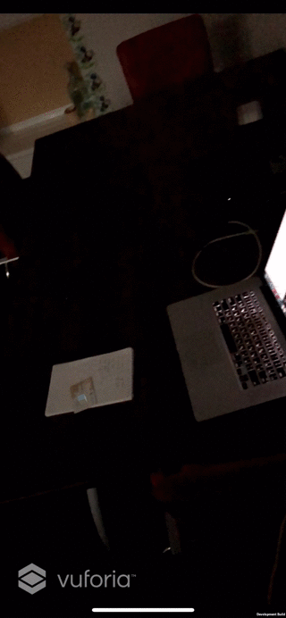
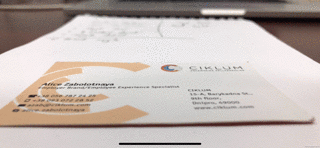
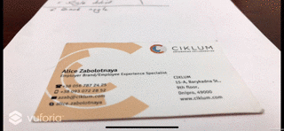
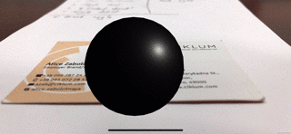
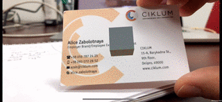

Detect object distance (GL)

ARKit | Vuforia (iOS) | Vuforia (Android) | ARCore
--- | --- | --- | ---
 |  |  | 

Detect object distance (BL)

ARKit | Vuforia (iOS) | Vuforia (Android) | ARCore
--- | --- | --- | ---
 |  | No test | No test

Lost object distance (GL)

ARKit | Vuforia (iOS) | Vuforia (Android) | ARCore
--- | --- | --- | ---
 |  |  | No test

Lost object distance (BL)

ARKit | Vuforia (iOS) | Vuforia (Android) | ARCore
--- | --- | --- | ---
 |  | No test | No test

Detect object angle (GL)

ARKit | Vuforia (iOS) | Vuforia (Android) | ARCore
--- | --- | --- | ---
 |  |  | 

Detect object angle (BL)

ARKit | Vuforia (iOS) | Vuforia (Android) | ARCore
--- | --- | --- | ---
 |  | No test | No test 

Lost object angle (GL)

ARKit | Vuforia (iOS) | Vuforia (Android) | ARCore
--- | --- | --- | ---
 |  | No test | No test

Lost object angle (BL)

ARKit | Vuforia (iOS) | Vuforia (Android) | ARCore
--- | --- | --- | ---
 |  | No test | No test

Recognition in different rotations

ARKit | Vuforia (iOS) | Vuforia (Android) | ARCore
--- | --- | --- | ---
 |  |  | 

Tracking during motion

ARKit | Vuforia (iOS) | Vuforia (Android) | ARCore
--- | --- | --- | ---
 |  |  | No test

