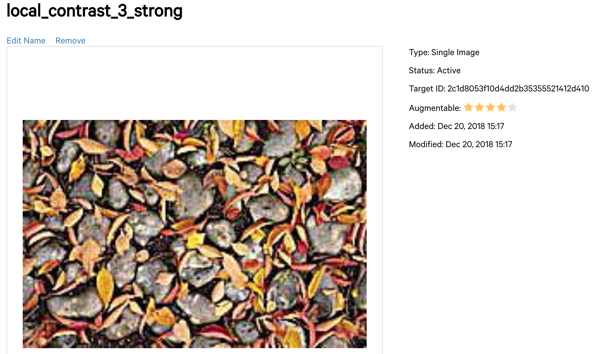
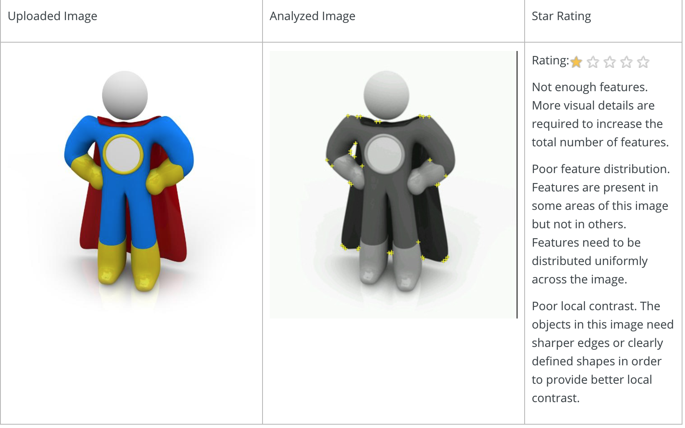
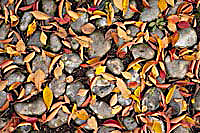
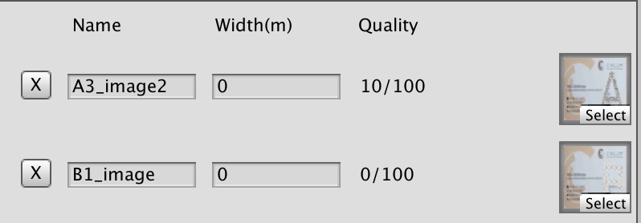
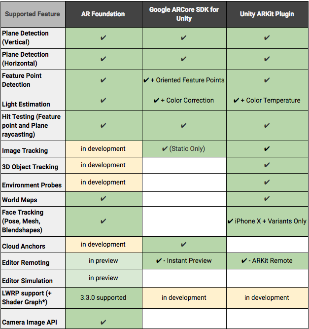

# Image Detection & Tracking Enigines Comparison

Greetings, hero. You are living in the magic time when two worlds: reality and imagination create a new visible realm: Augmented/Virtual Reality. 

There are plenty of instruments appeared in last five years and some of them can be used on mobile platform - every-day thing for most people. So we decided to pick new technologies of two most popular platform: *ARKit* for iOS, *ARCore* for Android a compare it to popular *Vuforia* on both platforms using intensly growing Unity.

As inital recognition subject we have taken Ciklum Bussiness Card.
Here are several points for comparison: 

* Detect object distance
* Lost object distance
* Detect object angle
* Lost object angle
* Recognition in different rotations
* Tracking during motion

Also we decided to try frameworks on different light environments:

* Good light (GL)
* Avarage-bad light (BL)

## Installation and building
### ARCore

In progress

### ARKit
Takes second place. First or course you need to download Unity plugin. For our goals we can use and modify UnityARImageAnchor example.
We can adding new images in a few steps: 
1. Copy image to the project
2. Create ARReferenceImage asset for earch image where we describe name, texture (actual image) and it's physical size.
3. Create ARReferenceImagesSet 
4. In ARCameraManager Game Object select the reference to created ARReferenceImagesSet

When any of the images described in the set are detected, events for add/update/remove specific  ARImageAnchor are triggered. We can use GenerateImageAnchor script to configure  preglabs depending on detected ARReferenceImage.

When we configured oru project it's time to run it. Usual procedure of building iOS project will run XCode, where you modify settings if you want and we can start testing.

### Vuforia
The easiest thing to use. Install plugin and...

1. Drop ARCamera to the scene
2. Drop Vuforia Image with your image to scene
3. Drop any object to anchor the image as a child object to previous one.

But that's not all. Yes, it's easy to use in projects but you need to do some work on their website.

1. Register on [Vuforia developer portal](https://developer.vuforia.com/)
2. Create target and get your secret key
3. !! Create database of images, download it and add to the project. It also has the same metadata as ARKit ARReferenceImage but it's hidden from you.

In the DefaultTrackableEventHandler you can configure tracking beavior and grab some frames. 
Then do some usual platform-specific stuff (min ioS version etc.) Profit.

## Image selection:
### Vuforia
Vuforia has a big [guide](https://library.vuforia.com/articles/Solution/Optimizing-Target-Detection-and-Tracking-Stability.html) how to select proper images for proper recogntion. As it says: 
> Attributes of an Ideal Image Target
> Rich in detail	
> Good contrast	
> No repetitive patterns
> Must be 8- or 24-bit PNG and JPG formats; less than 2 MB in size; JPGs must be RGB or greyscale (no CMYK)

It estimates every image from 0 to 5 starts based on these criterias. Vuforia works worse with circles and round-corner objects. More angeles === better. Works pretty good with high-detail textures: 

### ARKit
There is no image estimator here, but that's what Apple doc says:

>Be aware of image detection capabilities. Choose, design, and configure reference images for optimal reliability and performance:

> Enter the physical size of the image in Xcode as accurately as possible. ARKit relies on this information to determine the distance of the image from the camera. Entering an incorrect physical size will result in an ARImageAnchor that’s the wrong distance from the camera.

> When you add reference images to your asset catalog in Xcode, pay attention to the quality estimation warnings Xcode provides. Images with high contrast work best for image detection.

> Use only images on flat surfaces for detection. If an image to be detected is on a nonplanar surface, like a label on a wine bottle, ARKit might not recognize it at all, or might create an image anchor at the wrong location.

> Consider how your image appears under different lighting conditions. If an image is printed on glossy paper or displayed on a device screen, reflections on those surfaces can interfere with detection.

All in all it works kinda similar to Vuforia, but slightly worse.
### ARCore
Tips for selecting reference images

> * Augmented Images supports PNG and JPEG file formats. For JPEG files, avoid heavy compression for best performance.
> * Detection is solely based on points of high contrast, so both color and black/white images are detected, regardless of whether a color or black/white reference image is used.
> * The image's resolution should be at least 300 x 300 pixels.
> Using images with high resolution does not improve performance.
> * Avoid images with sparse features.
> * Avoid images with repetitive features.
> * A good reference image is hard to spot with the human eye. Use the arcoreimg tool to get a score between 0 and 100 for each image. We recommend a score of at least 75. Here are two examples:

You need ARCore Android SDK Tool - *arcoreimg* to create and estimate images. However comparing to wuforia it works better with round objects, but worse with high-detail pseudo-repetative images. For example:

#### 90/100

#### 0/100

## Shiny images:

Detect object distance (GL)

ARKit | Vuforia (iOS) | Vuforia (Android) | ARCore
--- | --- | --- | ---
 |  |  | 

Detect object distance (BL)

ARKit | Vuforia (iOS) | Vuforia (Android) | ARCore
--- | --- | --- | ---
 |  | No test | No test

Lost object distance (GL)

ARKit | Vuforia (iOS) | Vuforia (Android) | ARCore
--- | --- | --- | ---
 |  |  | No test

Lost object distance (BL)

ARKit | Vuforia (iOS) | Vuforia (Android) | ARCore
--- | --- | --- | ---
 |  | No test | No test

Detect object angle (GL)

ARKit | Vuforia (iOS) | Vuforia (Android) | ARCore
--- | --- | --- | ---
 |  |  | 

Detect object angle (BL)

ARKit | Vuforia (iOS) | Vuforia (Android) | ARCore
--- | --- | --- | ---
 |  | No test | No test 

Lost object angle (GL)

ARKit | Vuforia (iOS) | Vuforia (Android) | ARCore
--- | --- | --- | ---
 |  | No test | No test

Lost object angle (BL)

ARKit | Vuforia (iOS) | Vuforia (Android) | ARCore
--- | --- | --- | ---
 |  | No test | No test

Recognition in different rotations

ARKit | Vuforia (iOS) | Vuforia (Android) | ARCore
--- | --- | --- | ---
 |  |  | 

Tracking during motion

ARKit | Vuforia (iOS) | Vuforia (Android) | ARCore
--- | --- | --- | ---
 |  |  | No test

### Vuforia problems

Android:
 

iOS:

## Comparison results (clean bussiness card)

Well, *ARKit* works "just okay" it detects objects and tracks it pretty good. At some points even better than Vuforia (I believe detect distance with bad light is even better). But as significat cons: it lost tracking when I moved object slightly.

From the other hand though *Vuforia* had some slightly worse results in detecting objects with bad light it is almost impossible to trick it when it drops the anchor. Even if object lost it's details Vuforia does a great job and in some situations I just need to cover object with hand to drop tracking.
But at the same time I had bugs with simple build from the box on iOS platform: sometimes it just could not detect object even if it's in front of the camera, it had problems to detect object if it wasupside down and it even crushed when I changed device orientation. On Android there were some troubles as well even woth the good looked object.

*ARCore* can detect only static images and seems it has it's own algorithms how to estimate image points. While Vuforia gave 5 stars of recognition-quality to the image, ARCore gave 0/100...However it detects target with satisfactory accuracy, but this test is just not for him, because it lacks moving detection.

Anyway, Unity has "AR Foundation" API which tries to operate ARCore and ARKit with the same facade, but it's still in development. 

*Vuforia* as a long-time player on this stage takes the wheel, at least now, while AR Foundation is in progress.

## Let's update things

All guides tell one simple rule: increasing count of contrast non-round-corner pictures leads to better image recognition. Let's add some different letters with different textures to the business card and see if it can recognize different images and if it improves quallity:

Updated business card

ARKit | Vuforia | ARCore
--- | --- | ---
 |  | 
 | |

As we can see *Vuforia* does a great job. Detection is pretty fast and it recognizes different images perfectly.

*ARKit* works as in previous example pretty well. It can see difference between images, can calculate object position with good results. But when objects are close to camera there are some bugs: sometimes it just thinks that there is the same image and shows time preflabs.
 
*ARCore* engine tells the same things about new cards:

, though the first option has alredy 10/100.
Nevertheless it detects right both cards.

## Unique thnigs:
*Vuforia* has a lot of cool tricks, but most exciting is extended tracking, which makes it shine in most actions after the object was detected.

*ARCore* has possibility to upload anchors to the cloud, but works really clunky with Unity right now.

*ARKit* shines with face capturing they made with Unity last year.

## Full tech comparison

Here is some table from Unity blog about general state of tech race:

## Pros and Cons
### Vuforia:
Pros | Cons
--- | ---
Easy to setup | Has some problems on iOS
Extended tracking | Not always detect objects in different angles (again iOS)
Good detection distance | Has some troubles with versioning
Good detection angle |
Awesome motion tracking |
Long-time player on this stage (stable, innovance) | 
Multiplatform | 
### ARKit:
Pros | Cons
--- | ---
Some kind of native API  | All measurements are avarage (comparing to Vuforia)
Stable detection | Takes some time to setup with Unity

### ARCore:
Pros | Cons
--- | ---
Works good if you need to place object once | Need some tricks to setup project
 | Lack of motion detection
		